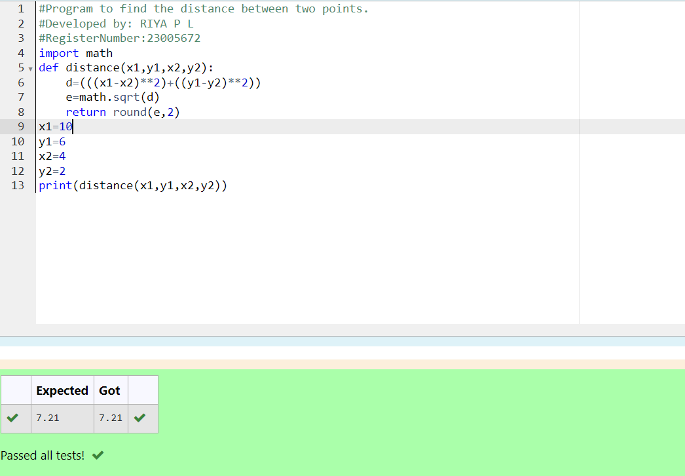

# DISTANCE-BETWEEN-TWO-POINTS

## AIM:
To write a python program to find the distance two 2 points
## ALGORITHM:
### Step 1: 
Get the coordinate input from the user for the first point
### Step 2:
Get the coordinate input from user for the second point 
### Step 3: 
Substitute the values in the distance formula  
### Step 4: 
Define the function
### Step 5:
Call the function 
### PROGRAM:
```PYTHON
#Program to find the distance between two points.
#Developed by: RIYA P L
#RegisterNumber:23005672
import math
def distance(x1,y1,x2,y2):
    d=(((x1-x2)**2)+((y1-y2)**2))
    e=math.sqrt(d)
    return round(e,2)
x1=10
y1=6
x2=4
y2=2
print(distance(x1,y1,x2,y2))
```
  


### OUTPUT:



### RESULT:
thus,the program runs successfully.
